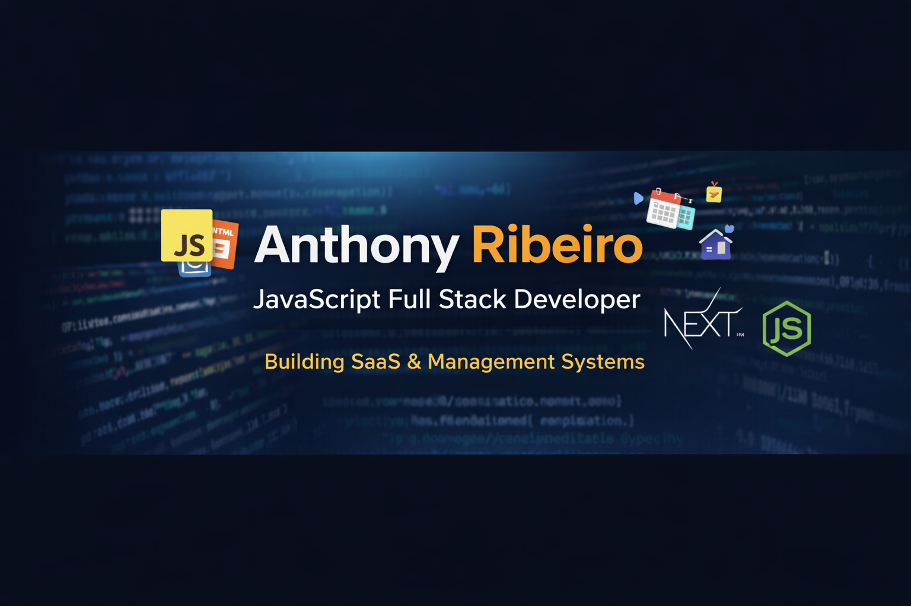

  

# 👋 Olá, eu sou o Anthony Ribeiro

💻 **JavaScript Full Stack Developer**
🚀 Construindo SaaS e Sistemas Web de Gestão
📍 Brasil

---

## 🧠 Sobre mim

Sou desenvolvedor focado em aplicações web utilizando JavaScript end-to-end.

Atualmente estou desenvolvendo plataformas SaaS voltadas para:

* Projetos sociais
* Sistemas de agendamento
* Dashboards administrativos

Meu foco é criar sistemas reais que resolvem problemas operacionais de empresas e instituições.

---

## 🛠️ Stack Principal

**Front-end**

* HTML
* CSS
* JavaScript
* Next.js

**Back-end**

* Node.js
* Supabase
* APIs REST

**Outros**

* Git & GitHub
* PDF generation
* Dashboards & Admin Panels

---

## 📌 Projeto em Destaque

📅 **Sistema de Agendamento**
Gestão de reservas para retiros e eventos.

---

## 🎯 Objetivo

Evoluir como desenvolvedor Full Stack especializado em JavaScript, criando SaaS escaláveis e soluções web profissionais.

---

## 📫 Contato

* LinkedIn: https://www.linkedin.com/in/anthonytcribeiro
* Email: anthony.tribeiro587@gmail.com

---

⭐ Sempre construindo, aprendendo e versionando.
